# ASP.NET Core Front-end + 2 Back-end APIs on Azure Container Apps

This repository contains a simple scenario built to demonstrate how ASP.NET Core 6.0 can be used to build a cloud-native application hosted in Azure Container Apps. The repository consists of the following projects and folders:

* Store - A Blazor server project representing the frontend of an online store. The store's UI shows a list of all the products in the store, and their associated inventory status. 
* Products API - A simple API that generates fake product names using the open-source NuGet package [Bogus](https://github.com/bchavez/Bogus). 
* Inventory API - A simple API that provides a random number for a given product ID string. The values of each string/integer pair are stored in memory cache so they are consistent between API calls. 
* Azure folder - contains Azure Bicep files used for creating and configuring all the Azure resources. 
* GitHub Actions workflow file used to deploy the app using CI/CD. 

## What you'll learn

This exercise will introduce you to a variety of concepts, with links to supporting documentation throughout the tutorial. 

* [Azure Container Apps](https://docs.microsoft.com/azure/container-apps/overview)
* [GitHub Actions](https://github.com/features/actions)
* [Azure Container Registry](https://docs.microsoft.com/azure/container-registry/)
* [Azure Bicep](https://docs.microsoft.com/azure/azure-resource-manager/bicep/overview?tabs=**bicep**)

## Prerequisites

You'll need an Azure subscription and a very small set of tools and skills to get started:

1. An Azure subscription. Sign up [for free](https://azure.microsoft.com/free/).
2. A GitHub account, with access to GitHub Actions.
3. Either the [Azure CLI](https://docs.microsoft.com/cli/azure/install-azure-cli) installed locally, or, access to [GitHub Codespaces](https://github.com/features/codespaces), which would enable you to do develop in your browser.

## Topology diagram

The resultant application is an Azure Container Environment-hosted set of containers - the `products` API, the `inventory` API, and the `store` Blazor Server front-end.

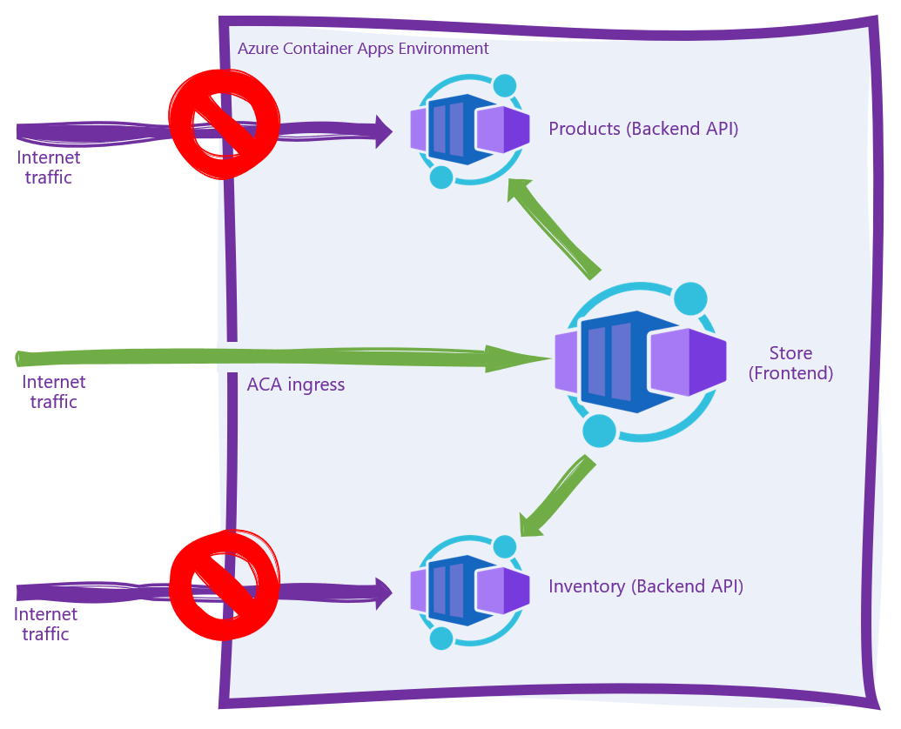

Internet traffic should not be able to directly access either of the back-end APIs as each of these containers is marked as "internal ingress only" during the deployment phase. Internet traffic hitting the `store.<your app>.<your region>.azurecontainerapps.io` URL should be proxied to the `frontend` container, which in turn makes outbound calls to both the `products` and `inventory` APIs within the Azure Container Apps Environment.

## Setup

By the end of this section you'll have a 3-node app running in Azure. This setup process consists of two steps, and should take you around 15 minutes. 

1. Use the Azure CLI to create an Azure Service Principal, then store that principal's JSON output to a GitHub secret so the GitHub Actions CI/CD process can log into your Azure subscription and deploy the code.
2. Edit the ` deploy.yml` workflow file and push the changes into a new `deploy` branch, triggering GitHub Actions to build the .NET projects into containers and push those containers into a new Azure Container Apps Environment. 

## Authenticate to Azure and configure the repository with a secret

1. Fork this repository to your own GitHub organization.
2. Create an Azure Service Principal using the Azure CLI. 

```bash
$subscriptionId=$(az account show --query id --output tsv)
az ad sp create-for-rbac --sdk-auth --name WebAndApiSample --role contributor --scopes /subscriptions/$subscriptionId
```

3. Copy the JSON written to the screen to your clipboard. 

```json
{
  "clientId": "",
  "clientSecret": "",
  "subscriptionId": "",
  "tenantId": "",
  "activeDirectoryEndpointUrl": "https://login.microsoftonline.com/",
  "resourceManagerEndpointUrl": "https://brazilus.management.azure.com",
  "activeDirectoryGraphResourceId": "https://graph.windows.net/",
  "sqlManagementEndpointUrl": "https://management.core.windows.net:8443/",
  "galleryEndpointUrl": "https://gallery.azure.com",
  "managementEndpointUrl": "https://management.core.windows.net"
}
```

4. Create a new GitHub secret in your fork of this repository named `AzureSPN`. Paste the JSON returned from the Azure CLI into this new secret. Once you've done this you'll see the secret in your fork of the repository.

   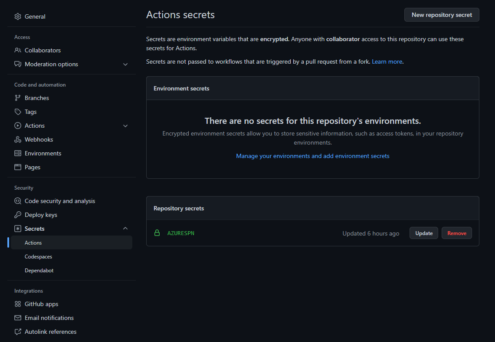

5. Create a second GitHub secret in your fork of this repository named `AZURE_SUBSCRIPTION_ID`. Provide the specific Azure subscription you want to impact as the value for this secret. Ocne finished, the two secrets' names will show on the page. 

   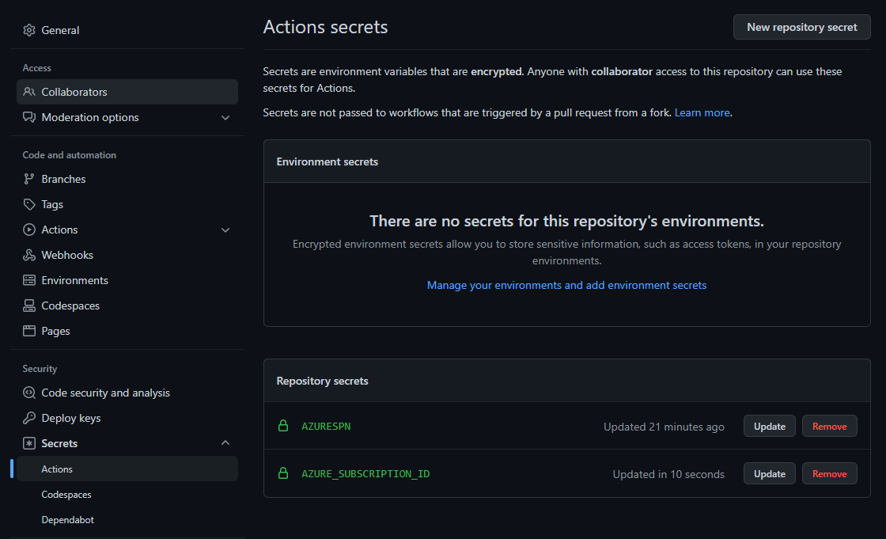

> Note: Never save the JSON to disk, for it will enable anyone who obtains this JSON code to create or edit resources in your Azure subscription. 

## Deploy the code using GitHub Actions

The easiest way to deploy the code is to make a commit directly to the `deploy` branch. Do this by navigating to the `deploy.yml` file in your browser and clicking the `Edit` button. 

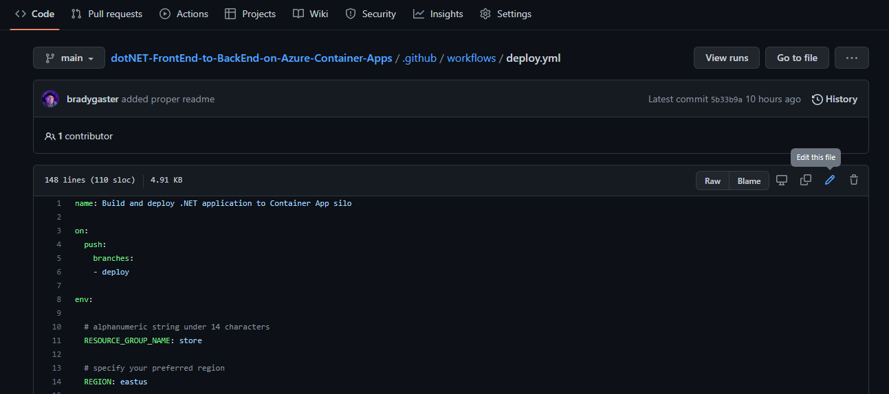

Provide a custom resource group name for the app, and then commit the change to a new branch named `deploy`. 

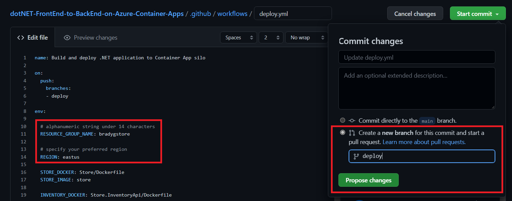

Once you click the `Propose changes` button, you'll be in "create a pull request" mode. Don't worry about creating the pull request yet, just click on the `Actions` tab, and you'll see that the deployment CI/CD process has already started. 

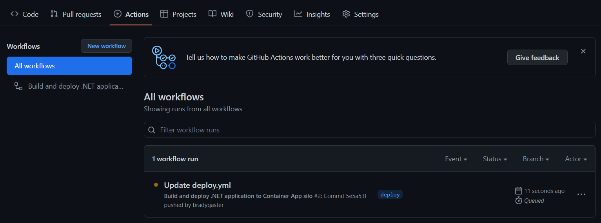

When you click into the workflow, you'll see that there are 3 phases the CI/CD will run through:

1. provision - the Azure resources will be created that eventually house your app.
2. build - the various .NET projects are build into containers and published into the Azure Container Registry instance created during provision.
3. deploy - once `build` completes, the images are in ACR, so the Azure Container Apps are updated to host the newly-published container images. 

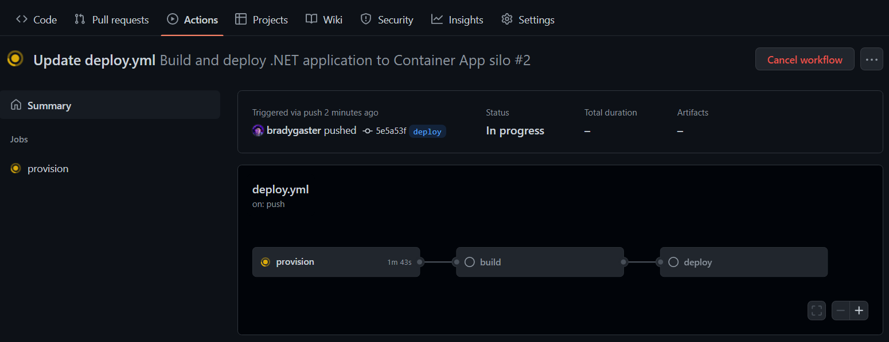

After a few minutes, all three steps in the workflow will be completed, and each box in the workflow diagram will reflect success. If anything fails, you can click into the individual process step to see the detailed log output. 

> Note: if you do see any failures or issues, please submit an Issue so we can update the sample. Likewise, if you have ideas that could make it better, feel free to submit a pull request.

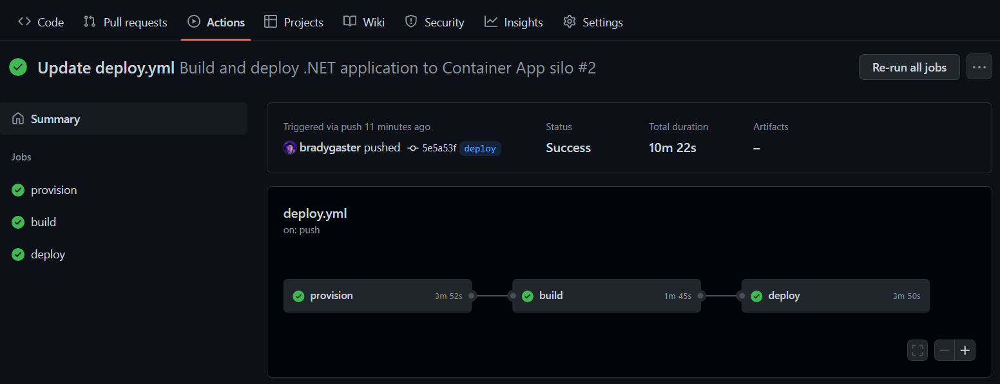

With the projects deployed to Azure, you can now test the app to make sure it works. 

## Try the app in Azure

The `deploy` CI/CD process creates a series of resources in your Azure subscription. These are used primarily for hosting the project code, but there's also a few additional resources that aid with monitoring and observing how the app is running in the deployed environment. 
| Resource  | Resource Type                                                | Purpose                                                      |
| --------- | ------------------------------------------------------------ | ------------------------------------------------------------ |
| storeai   | Application Insights                                         | This provides telemetry and diagnostic information for when I want to monitor how the app is performing or for when things need troubleshooting. |
| store     | An Azure Container App that houses the code for the front end. | The store app is the store's frontend app, running a Blazor Server project that reaches out to the backend APIs |
| products  | An Azure Container App that houses the code for a minimal API. | This API is a Swagger UI-enabled API that hands back product names and IDs to callers. |
| inventory | An Azure Container App that houses the code for a minimal API. | This API is a Swagger UI-enabled API that hands back quantities for product IDs. A client would need to call the `products` API first to get the product ID list, then use those product IDs as parameters to the `inventory` API to get the quantity of any particular item in inventory. |
| storeenv  | An Azure Container Apps Environment                          | This environment serves as the networking meta-container for all of the instances of all of the container apps comprising the app. |
| storeacr  | An Azure Container Registry                                  | This is the container registry into which the CI/CD process publishes my application containers when I commit code to the `deploy` branch. From this registry, the containers are pulled and loaded into Azure Container Apps. |
| storelogs | Log Analytics Workspace                                      | This is where I can perform custom [Kusto](https://docs.microsoft.com/azure/data-explorer/kusto/query/) queries against the application telemetry, and time-sliced views of how the app is performing and scaling over time in the environment. |

The resources are shown here in the Azure portal:

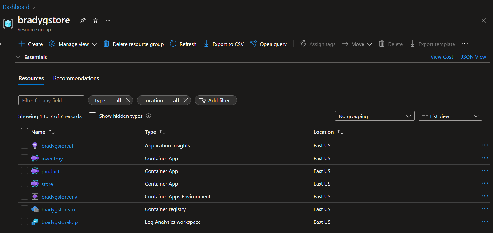

Click on the `store` container app to open it up in the Azure portal. In the `Overview` tab you'll see a URL. 

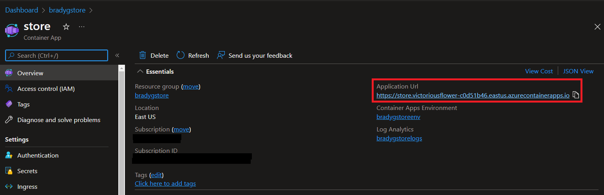

Clicking that URL will open the app's frontend up in the browser. 

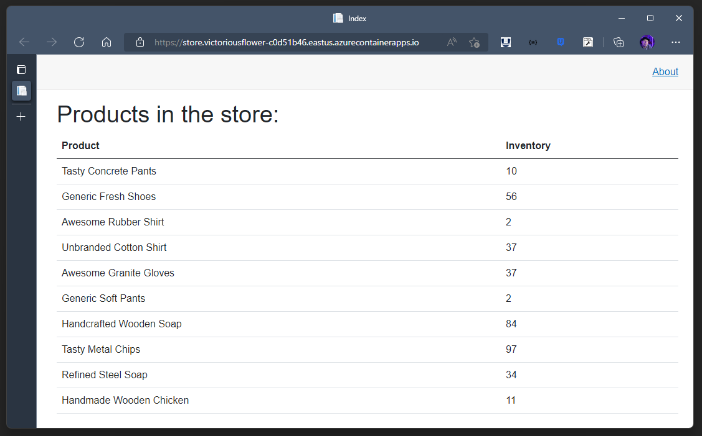

You'll see that the first request will take slightly longer than subsequent requests. On the first request to the page, the APIs are called on the server side. The code uses `IMemoryCache` to store the results of the API calls in memory. So, subsequent calls will use the cached payload rather than make live requests each time. 
